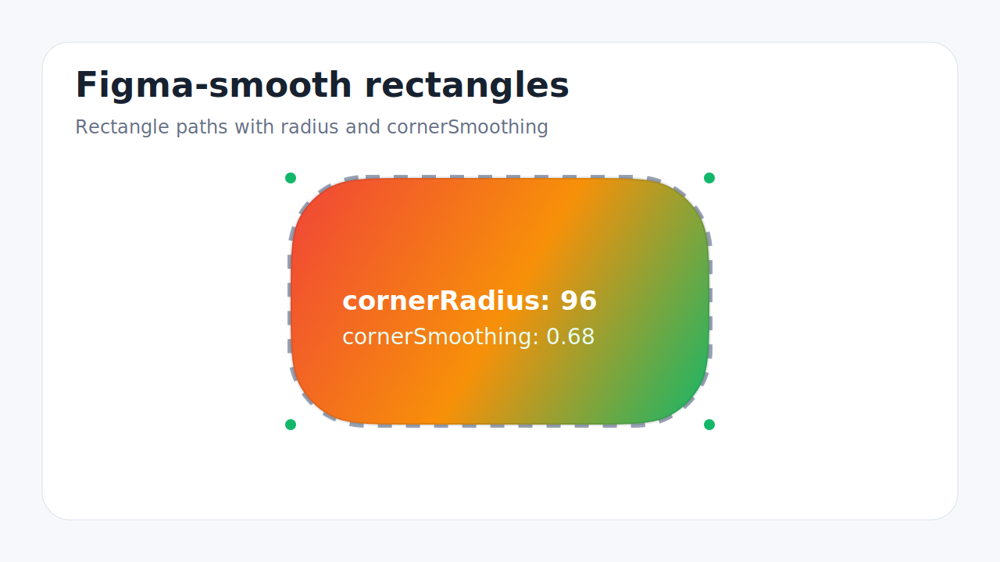
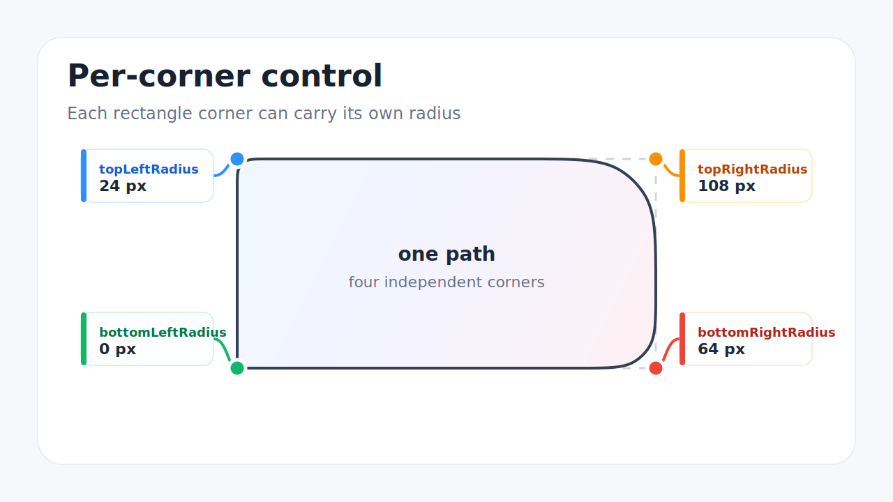
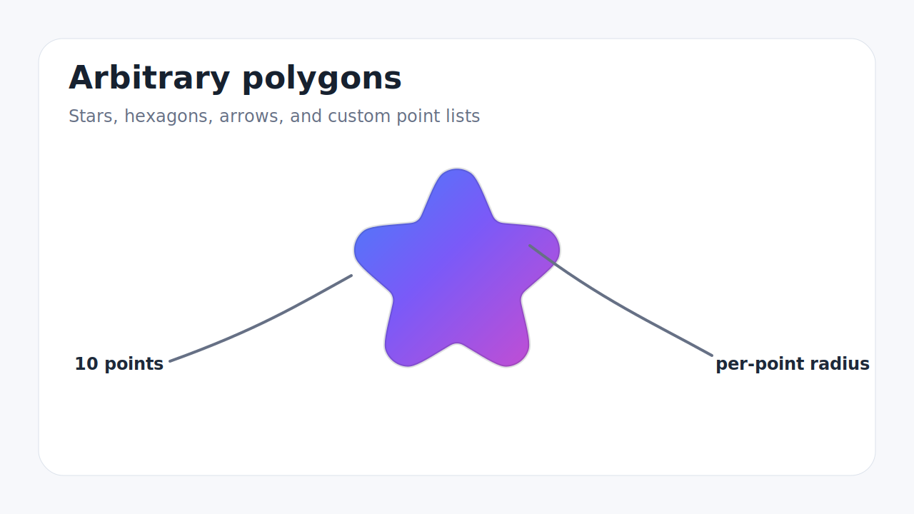
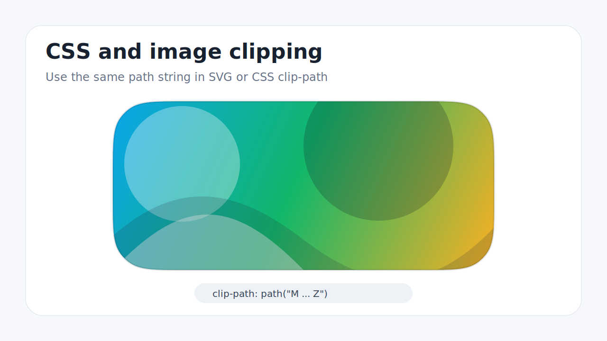

# squircle-path-kit

Figma-exact SVG squircle paths — corner rounding **and** corner smoothing for
rectangles and arbitrary polygons.

Interactive examples and code snippets: <https://msurguy.github.io/squircle-path-kit/>

The construction was reverse-engineered from ground-truth SVG exports produced
by Figma itself and is verified in the test suite to match Figma's output
within **0.01px** across 60°, 90°, and 120° corners, per-corner radii, and
budget-clamped cases.

Unlike rectangle-only libraries, this one handles **any closed polygon** —
triangles, hexagons, stars, arrows, custom shapes — with a different radius
and smoothing value per corner if you want.

## Preview

<video src="https://raw.githubusercontent.com/msurguy/squircle-path-kit/refs/heads/main/docs/assets/squircle-path-kit-promo.mp4" controls muted playsinline width="100%"></video>

## Install

```bash
npm install @msurguy/squircle-path-kit
```

## Representative use cases

All snippets assume:

```ts
import {
  getSquirclePath,
  getSquircleRectPath,
} from "@msurguy/squircle-path-kit";
```

### Figma-smooth SVG rectangles



```ts
const d = getSquircleRectPath({
  width: 320,
  height: 180,
  cornerRadius: 48,
  cornerSmoothing: 0.68,
});
```

### Per-corner radii



```ts
const d = getSquircleRectPath({
  width: 320,
  height: 180,
  topLeftRadius: 12,
  topRightRadius: 64,
  bottomRightRadius: 36,
  bottomLeftRadius: 0,
  cornerSmoothing: 0.72,
});
```

### Arbitrary polygons



```ts
const d = getSquirclePath(points, {
  defaultRadius: 24,
  defaultSmoothness: 0.7,
});
```

### CSS and image clipping



```ts
element.style.clipPath = `path('${getSquircleRectPath({
  width,
  height,
  cornerRadius: 24,
  cornerSmoothing: 0.8,
})}')`;
```

## Usage

### Rectangles (mirrors Figma's rectangle properties)

```ts
import { getSquircleRectPath } from "@msurguy/squircle-path-kit";

const d = getSquircleRectPath({
  width: 200,
  height: 200,
  cornerRadius: 40,
  cornerSmoothing: 0.6, // Figma's ξ — 0.6 ≈ the iOS app-icon shape
});

// <path d={d} fill="tomato" />
```

Per-corner radii, offsets, and precision are supported:

```ts
getSquircleRectPath({
  x: 10,
  y: 10,
  width: 240,
  height: 240,
  topLeftRadius: 10,
  topRightRadius: 40,
  bottomRightRadius: 80,
  bottomLeftRadius: 0,
  cornerSmoothing: 0.6,
  precision: 3,
});
```

### Arbitrary polygons

```ts
import { getSquirclePath } from "@msurguy/squircle-path-kit";

// A hexagon with smooth corners
const pts = Array.from({ length: 6 }, (_, k) => {
  const th = ((-90 + k * 60) * Math.PI) / 180;
  return { x: 120 + 120 * Math.cos(th), y: 120 + 120 * Math.sin(th) };
});

const d = getSquirclePath(pts, { defaultRadius: 40, defaultSmoothness: 0.6 });
```

Each point can override radius and smoothing:

```ts
getSquirclePath(
  [
    { x: 0, y: 0, radius: 10, smoothness: 1.0 },
    { x: 240, y: 0, radius: 40 }, // uses defaults below
    { x: 240, y: 240, radius: 80, smoothness: 0.3 },
    { x: 0, y: 240 }, // radius 0 -> sharp corner
  ],
  { defaultRadius: 20, defaultSmoothness: 0.6 },
);
```

### React example

```tsx
function Squircle({ size = 200, radius = 40, smoothing = 0.6 }) {
  const d = getSquircleRectPath({
    width: size,
    height: size,
    cornerRadius: radius,
    cornerSmoothing: smoothing,
  });
  return (
    <svg width={size} height={size} viewBox={`0 0 ${size} ${size}`}>
      <path d={d} fill="currentColor" />
    </svg>
  );
}
```

### React Native example

The runtime is pure JavaScript and the package exposes a `react-native` entry
point that uses the same ESM build. Pair it with `react-native-svg`:

```tsx
import Svg, { Defs, ClipPath, Image, Path } from "react-native-svg";
import { getSquircleRectPath } from "@msurguy/squircle-path-kit";

const d = getSquircleRectPath({
  width: 300,
  height: 180,
  cornerRadius: 32,
  cornerSmoothing: 0.7,
});

export function SquircleImage({ href }: { href: string }) {
  return (
    <Svg width={300} height={180} viewBox="0 0 300 180">
      <Defs>
        <ClipPath id="clip">
          <Path d={d} />
        </ClipPath>
      </Defs>
      <Image
        href={href}
        width={300}
        height={180}
        preserveAspectRatio="xMidYMid slice"
        clipPath="url(#clip)"
      />
    </Svg>
  );
}
```

### CSS `clip-path`

```ts
element.style.clipPath = `path('${getSquircleRectPath({ width, height, cornerRadius: 24, cornerSmoothing: 0.8 })}')`;
```

## API

### `getSquirclePath(points, options?)`

| Param                       | Type              | Description                                                                               |
| --------------------------- | ----------------- | ----------------------------------------------------------------------------------------- |
| `points`                    | `SquirclePoint[]` | ≥3 vertices of a closed polygon (`Z` is appended). Each: `{ x, y, radius?, smoothness? }` |
| `options.defaultRadius`     | `number`          | Radius for points without their own. Default `0`.                                         |
| `options.defaultSmoothness` | `number`          | Smoothing ξ ∈ [0,1] for points without their own. Default `0`.                            |
| `options.precision`         | `number`          | Output decimal places. Default `2`.                                                       |

Returns the SVG path `d` string.

### `getSquircleRectPath(options)`

`{ width, height, x?, y?, cornerRadius?, topLeftRadius?, topRightRadius?, bottomRightRadius?, bottomLeftRadius?, cornerSmoothing?, precision? }`

Individual corner radii override `cornerRadius`. Radii clamp to half the
short side, exactly like Figma.

## How it matches Figma

Per corner with opening angle φ (turn = π − φ), radius R, smoothing ξ:

```
q = R / tan(φ/2)            tangent length of plain rounding
p = (1 + ξ) · q             total edge length consumed
β = (turn / 2) · ξ          heading change per smoothing ramp
t = R · tan(β/2)            tangent length at the ramp/arc junction
arc sweep = turn · (1 − ξ)  the circular arc shrinks as ξ grows
```

Each corner is drawn as: smoothing cubic → circular arc (as cubics) →
smoothing cubic. The smoothing cubic's control points sit at distances
`p`, `p − a`, and `q − t` from the vertex along the edge line
(`a = 2b`, `a + b = p − q + t`), which yields zero curvature where the
corner meets the straight edge — the squircle's signature property.

When rounding + smoothing don't fit an edge, the budget is clamped the way
Figma does it: radius first, then effective smoothing (`ξ_eff = p/q − 1`).
Competing corners on a short edge split it proportionally to their demand,
order-independently, so symmetric shapes stay symmetric.

## Development

```bash
npm install
npm run dev        # local example site
npm test           # builds library + runs tests
npm run build      # builds library + GitHub Pages site
npm run pack:check # verify npm package contents
```

The npm package is intentionally small: published files are limited to
`dist`, `README.md`, and `LICENSE`. The Vite/React example site is development
tooling only and is not part of the package tarball.

## License

MIT
